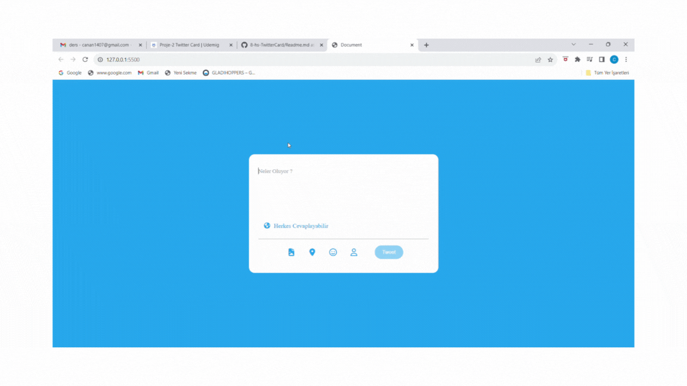

<h1>home page</h1>
In this project, we developed a tweeting clone on twitter. We used HTML, CSS and JavaScript in the project. We set a limitation depending on the number of characters we entered. Thanks to this limitation, the background of the extra characters entered became red. We activated our tweet button depending on this process.

<h1>used technologies</h1>

HTML
CSS
JavaScript

<h1>twitterCard</h1>

